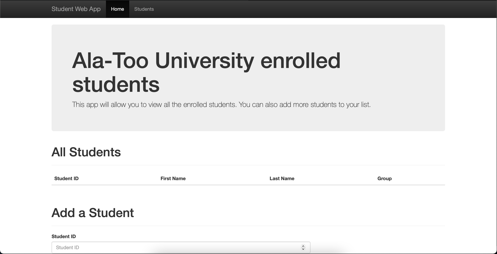

# Student Web Application
This is project for Finals for Web Technologies<br />

# Feature list:
<b>HTML, CSS, Bootstrap, Python, Flask</b> were used for this project<br />

# Team members students of COM-19A:
Pamirbek Almazbekov

Aisuluu Arstanbaeva

# How to run
First of all you must have the Flask installed on your computer. This projects works on local server, all you have to do is start the app.py file. To do it write the code below in terminal<br /><br />
```python app.py```<br /><br />
Then it must start the local server and write the link that you should copy and past to the browser (For example: <i>http://127.0.0.1:5000/</i>)<br /><br />
The beginning of the site will look like below. The <b>Bootstrap</b> really helped us to build adaptive site<br /><br />
<br /><br />
In ID field you can not write letters<br /><br />
<br /><br />
And you can add students. Image below shows us already added students and how to add them<br /><br />
<br /><br />
The team members are Pamirbek Almazbekov and Aisuluu Arstanbaeva
